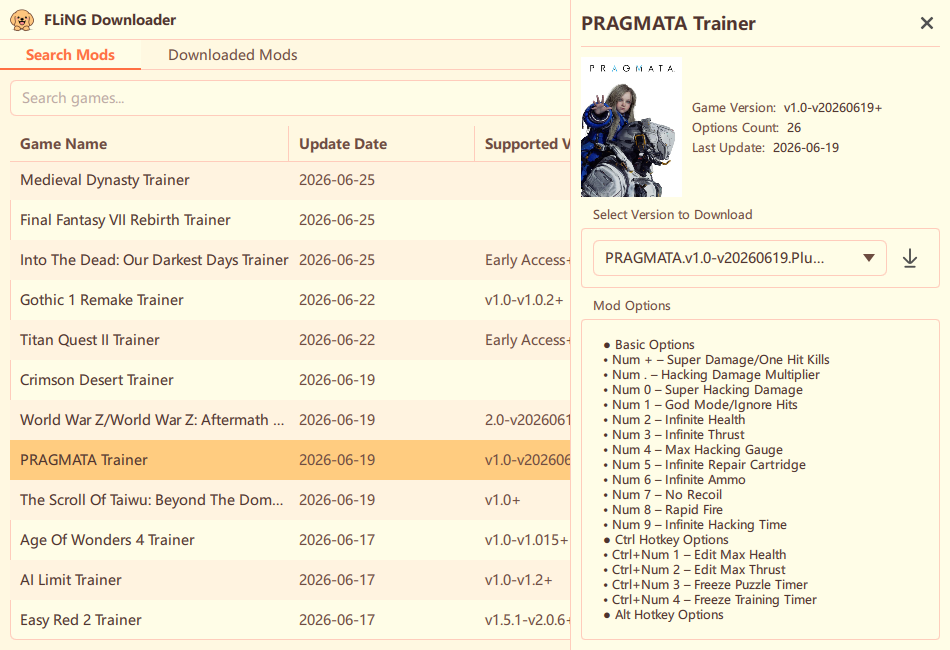

  

# FLiNG Downloader

基于 Qt 的游戏修改器下载管理器，支持中文游戏名智能映射搜索。

[简体中文](./README.md) | [English](./docs/README.en.md) | [日本語](./docs/README.ja.md)

---

## 功能

- 现代化界面与多主题（浅色、Windows 11、经典、彩色）
- 中文游戏名搜索，自动映射为英文进行检索
- 一键下载与分类管理修改器文件
- 内置多语言：中文、英文、日文
- 实时检测并提示可用更新

## 界面截图

## 系统要求

- Windows 10 及以上
- 不需要额外依赖，已静态链接必需库

## 快速开始

- 从 [Releases](../../releases) 下载最新版本，解压运行 `FLiNG Downloader.exe`

## 开发与构建（Windows）

需要安装 Visual Studio 2022、CMake、Qt 6 和 vcpkg。配置好 `VCPKG_ROOT` 与 `CMAKE_PREFIX_PATH` 后，直接运行 `build.cmd`。

### build.cmd 常见用法

- **`build.cmd` 或 `build.cmd release`**: 默认使用 Ninja 构建 Release 版本（输出到 `build\ninja-release`）
- **`build.cmd debug`**: 构建 Debug 版本（输出到 `build\ninja-debug`）
- **`build.cmd run` / `build.cmd run debug`**: 构建并立即运行程序
- **`build.cmd clean`**: 删除整个 `build` 构建目录
- **`build.cmd rebuild`**: 清除旧目录并重新配置、构建
- **`build.cmd i18n`**: 更新所有翻译源码文件（`.ts`）并生成翻译所需文件（`.qm`）

构建完成后，可执行文件位于对应的 `build\ninja-release\` 或 `build\ninja-debug\` 目录下。

## 安全与隐私

- 可能被 Windows Defender 误报（如 `Win32/Wacapew.C!ml`），属误报，程序安全。
- 不收集个人信息；网络请求仅用于搜索与下载；配置仅本地存储。

## 许可与反馈

- 许可：GNU AGPL v3，详见 [LICENSE](LICENSE)
- 反馈：请在 GitHub 提交 [Issues](../../issues)
