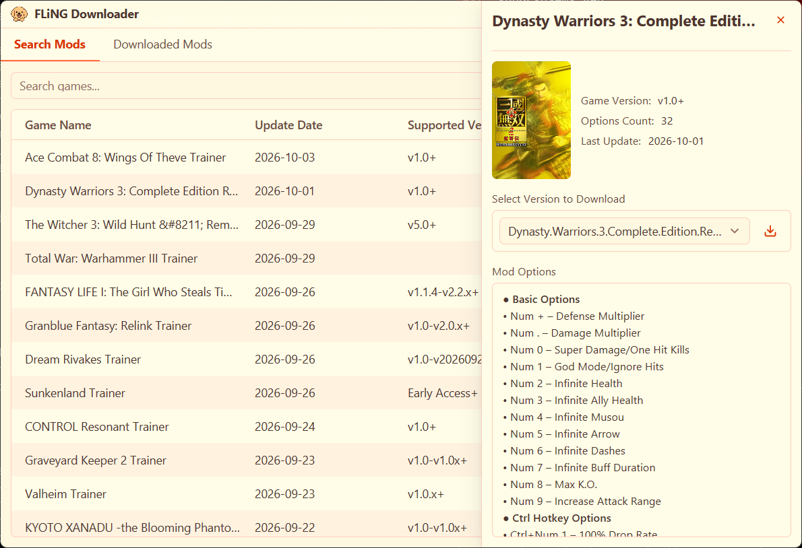

<div align="center">
  
</div>

# FLiNG Downloader

[简体中文](../README.md) | [English](./README.en.md) | [日本語](./README.ja.md)

---

## 機能

- GPU 描画のネイティブ UI（Rust + GPUI）と 9 種類のテーマ（ライト、ダーク、オーシャン、夕焼け、森林、ラベンダー、ローズ、深夜、モカ）
- ローカル SQLite 翻訳データベースによる中英日ゲーム名検索とサジェスト
- 中国語・日本語のゲーム名を FLiNG 公式サイトで使われる標準英語タイトルに自動変換して検索
- トレーナー名を日本語または中国語で表示可能（例：「エルデンリング (Elden Ring)」）。新しくダウンロードしたファイルも同じ名前で保存
- ワンクリックダウンロードとトレーナーの分類管理
- ダウンロード進捗のリアルタイム表示、一時停止 / 再開、ダウンロード済み一覧管理
- 内蔵言語：中文・英語・日本語（即時切り替え）
- ローカル ONNX モデルによりトレーナーのスクリーンショットからゲームのカバーを自動切り出し
- アプリ本体の更新チェックとインストーラーのダウンロード
- 翻訳データベースの独立更新に対応し、同梱版と AppData 上書き版のうち新しい有効な方を自動選択

## スクリーンショット



## 動作環境

- Windows 10（1903）以降、64 ビット
- ランタイムのインストールは不要です。ポータブル版とインストーラーに必要なファイルがすべて含まれます（ONNX Runtime は実行ファイルに組み込み済み）。

## FLiNG との関係

本プロジェクトは独立したオープンソースのダウンローダーであり、公式の FLiNG Trainer **とは無関係**です。改造ツール本体はホストも再配布もせず、公開ソースからの検索とダウンロードだけを行います。ゲーム改造ツールは利用規約に反する場合があるため、利用は自己責任です。

## クイックスタート

- [Releases](../../releases) から最新版を入手
- ポータブル版：展開して `FLiNG Downloader.exe` を実行
- インストーラー：`setup.exe` を実行
- ファイル検証：同バージョンの `SHA256SUMS.txt`（今後のリリースから添付）
- Windows Defender の誤検出：[FAQ](./ANTIVIRUS_FAQ.md)

## 開発・ビルド（Windows）

Rust stable（`x86_64-pc-windows-msvc`）と Visual Studio 2022 以降の C++ ビルドツールが必要です。Qt・CMake・vcpkg は不要で、ONNX Runtime は初回ビルド時に自動ダウンロードされ静的リンクされます。

```bat
cargo run -p fling-ui                 :: ビルドして実行（Debug）
cargo test --workspace                :: すべてのテスト
cargo clippy --workspace --all-targets -- -D warnings
cargo fmt --all
cargo bench -p fling-cover            :: カバー検出のベンチマーク
cargo xtask dist [--version 1.2.0]    :: dist\FLiNG Downloader\ にリリース用フォルダを作成
cargo xtask notices                   :: THIRD_PARTY_NOTICES.md の依存一覧を再生成
```

### プロジェクト構成

フロントエンドとバックエンドを分離した Cargo workspace です。UI はコマンドとイベントだけでバックエンドとやり取りします。

| Crate | 役割 |
|---|---|
| `fling-core` | ドメイン型と純粋関数（バージョン比較、タイトル正規化、ファイル種別判定） |
| `fling-net` | HTTP 抽象と reqwest 実装（レジューム、Referer、タイムアウト）、テスト用のフェイク |
| `fling-config` | AppData のパスと QSettings 互換の `settings.ini` |
| `fling-mapping` | 翻訳データベース、中日→英語タイトル変換、検索サジェスト |
| `fling-site` | flingtrainer.com の解析、検索、最近の更新一覧 |
| `fling-download` | ダウンロードキュー（一時停止 / 再開 / 同時 3 件）とダウンロード済み一覧 |
| `fling-update` | GitHub / Gitee からのアプリ・データベース更新 |
| `fling-cover` | カバーキャッシュと ONNX カバー検出 |
| `fling-app` | バックエンドの窓口：全サービスを保持し `Command` / `Event` を公開 |
| `fling-ui` | GPUI フロントエンド（`FLiNG Downloader.exe`） |
| `xtask` | パッケージングとリポジトリ作業 |

### テスト

- 各 crate に単体テスト、`fling-app/tests`・`fling-site/tests`・`fling-mapping/tests` に結合テスト
- テストは外部ネットワークや実際の AppData に触れません（フェイク HTTP クライアントと一時ディレクトリを使用）
- `fling-site/tests/fixtures/` にサイトのページ、`fling-cover/tests/screenshots/` にカバー検出用サンプル

## 翻訳データベース

- アプリは外部 SQLite データベース `fling_translations.db` を使用します
- リリースパッケージにはアプリ配下の `resources/` に同梱版が含まれます
- DB 更新後は AppData の上書き先に保存され、アプリは同梱版と上書き版のバージョンを比較して、新しい有効な方を使用します
- DB は [game-mappings-updater](https://github.com/Sqhh99/game-mappings-updater) で生成・公開され、サブモジュールとして `tools/game-mappings-updater` に配置されています（`git submodule update --init` で取得）
- 有効な DB には以下が必要です：
  - `metadata.release_tag`
  - `metadata.schema_version`（任意。存在する場合は `1` であること）
  - `games.english`
  - `games.normalized_english`
  - `games.chinese_simplified`
  - `games.japanese`

## CI / リリース

- `build.yml` はフォーマット確認、clippy、テスト、パッケージングを実行します
- `make-release.yml` はインストーラーとポータブル版を生成し、`fling_translations.db` と `SHA256SUMS.txt` を同梱します
- どちらのパッケージにも、本体、カバーモデル（`models/`）、同梱データベース（`resources/`）、MSVC ランタイムが含まれます

### バージョン公開

- `v` で始まる tag を push すると、自動で `make-release.yml` が実行され、GitHub Release が作成されます
- 正式版の例：

```bash
git tag v1.2.0
git push origin v1.2.0
```

- プレリリース版の例：

```bash
git tag v1.2.0-beta.1
git push origin v1.2.0-beta.1
```

- 固定ルール：
  - `-` を含まない tag：正式版
  - `-` を含む tag：GitHub の Pre-release

## セキュリティとプライバシー

- Windows Defender による誤検知（例: `Win32/Wacapew.C!ml`）が発生する場合がありますが、誤検知です。
- 個人情報は収集しません。ネットワーク通信は検索、ダウンロード、更新確認のみに使用され、設定と DB 上書きファイルはローカルにのみ保存されます。

## ライセンスとフィードバック

- ライセンス: GNU AGPL v3（[LICENSE](../LICENSE)）
- 第三者ライセンス: [THIRD_PARTY_NOTICES.md](../THIRD_PARTY_NOTICES.md)
- 不具合と合意済みの機能: [Issues](../../issues)
- 使い方の質問とアイデア: [Discussions](../../discussions)
- 開発参加: [CONTRIBUTING.md](../CONTRIBUTING.md)
- 脆弱性: [SECURITY.md](../SECURITY.md)
